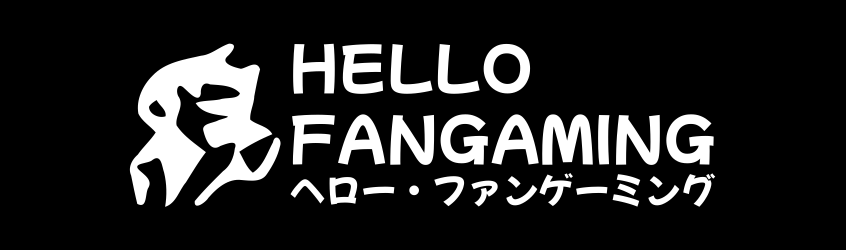

**Hello Fangaming** (ヘロー・ファンゲーミング) is a weeaboo game developer focused on making anime games, and is a long-time developer that has been making fangames **since 2006**. Hello Fangaming's main project is **Isekai Emblem**, a large and ambitious Fire Emblem anime crossover tactical RPG featuring characters from a wide variety of isekai anime series!

Hello Fangaming originally started off making Mario fangames using GameMaker, but eventually made the transition from GameMaker to **Unity**, and from Mario fangames to **anime games**, which is the current focus. The period of time Hello Fangaming released non-anime games (2006-2019) is Hello Fangaming's *kurorekishi* (Dark history, An embarrassing past), and Hello Fangaming's best games are the anime games that come after this dark period. Hello Fangaming's kurorekishi can be found in the [Hello Fangaming Time Capsule](https://hellofangaming.github.io/TimeCapsule/). Nowadays, Hello Fangaming mainly works on [Isekai Emblem](https://hellofangaming.github.io/IsekaiEmblem/), a Fire Emblem isekai anime crossover game that will be updated with new content regularly!
